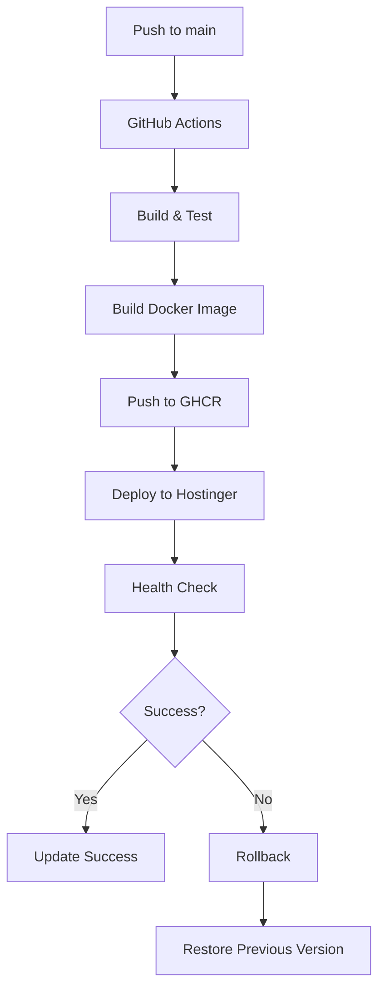

# 🚀 Architecture CI/CD DealToBook

## 🎯 **Stratégie Retenue**

### **Configuration :**
- **Environnement** : PROD uniquement (futur staging)
- **Déploiement** : Auto sur push `main`
- **Approche** : Déploiement par service + orchestration centralisée
- **Rollback** : Blue/Green deployment
- **Registry** : GitHub Container Registry (GHCR)

## 🏗️ **Architecture Technique**

### **Workflow de Déploiement :**


### **Services et Repos :**
| Service | Type | Port | Registry Image |
|---------|------|------|----------------|
| **deal-generator** | Backend | 8083 | `ghcr.io/skaouech/dealdealgenerator` |
| **deal-security** | Backend | 8085 | `ghcr.io/skaouech/dealsecurity` |
| **deal-setting** | Backend | 8081 | `ghcr.io/skaouech/dealsetting` |
| **deal-website** | Frontend | 4201 | `ghcr.io/skaouech/dealtobook-deal-website` |
| **deal-webui** | Frontend | 4200 | `ghcr.io/skaouech/dealtobook-deal-webui` |

## 🔧 **Configuration des Secrets**

### **Secrets GitHub (Centralisés dans dealtobook-devops) :**
```bash
# Registry
GHCR_TOKEN=ghp_xxx                    # Token GitHub pour GHCR
GITHUB_USERNAME=skaouech               # Username GitHub

# Deployment
HOSTINGER_SSH_KEY=-----BEGIN...       # Clé SSH privée
HOSTINGER_HOST=148.230.114.13         # IP du serveur
HOSTINGER_USER=root                   # Utilisateur SSH

# Application
POSTGRES_PASSWORD=xxx                 # Mot de passe PostgreSQL
KEYCLOAK_ADMIN_PASSWORD=xxx          # Mot de passe admin Keycloak
```

### **Variables d'Environnement :**
```bash
# Build
REGISTRY=ghcr.io/skaouech
ENVIRONMENT=prod
COMPOSE_FILE=docker-compose.ssl-complete.yml

# Tagging Strategy
IMAGE_TAG=${GITHUB_SHA::8}           # SHA court du commit
LATEST_TAG=latest                    # Tag latest pour prod
```

## 📦 **Dockerfiles Optimisés**

### **Backend Services (Spring Boot) :**
```dockerfile
# Multi-stage build pour optimiser la taille
FROM maven:3.9-openjdk-17 AS build
WORKDIR /app
COPY pom.xml .
RUN mvn dependency:go-offline
COPY src ./src
RUN mvn clean package -DskipTests -Pprod

FROM openjdk:17-jre-slim
RUN apt-get update && apt-get install -y curl && rm -rf /var/lib/apt/lists/*
WORKDIR /app
COPY --from=build /app/target/*.jar app.jar
EXPOSE 8080
HEALTHCHECK --interval=30s --timeout=10s --start-period=60s --retries=3 \
  CMD curl -f http://localhost:8080/management/health || exit 1
ENTRYPOINT ["java", "-jar", "app.jar"]
```

### **Frontend Services (Angular) :**
```dockerfile
# Multi-stage build
FROM node:18-alpine AS build
WORKDIR /app
COPY package*.json ./
RUN npm ci --legacy-peer-deps
COPY . .
RUN npm run build --prod

FROM nginx:alpine
COPY --from=build /app/dist /usr/share/nginx/html
COPY nginx.conf /etc/nginx/nginx.conf
EXPOSE 80
HEALTHCHECK --interval=30s --timeout=10s --start-period=30s --retries=3 \
  CMD curl -f http://localhost || exit 1
```

## ⚙️ **Workflows GitHub Actions**

### **Backend Workflow (.github/workflows/ci-cd.yml) :**
```yaml
name: CI/CD Backend Service
on:
  push:
    branches: [main]
  pull_request:
    branches: [main]

env:
  REGISTRY: ghcr.io
  IMAGE_NAME: ${{ github.repository }}

jobs:
  build-and-deploy:
    runs-on: ubuntu-latest
    permissions:
      contents: read
      packages: write
    
    steps:
    - name: Checkout
      uses: actions/checkout@v4
    
    - name: Set up JDK 17
      uses: actions/setup-java@v3
      with:
        java-version: '17'
        distribution: 'temurin'
    
    - name: Cache Maven dependencies
      uses: actions/cache@v3
      with:
        path: ~/.m2
        key: ${{ runner.os }}-m2-${{ hashFiles('**/pom.xml') }}
    
    - name: Build with Maven
      run: mvn clean compile -DskipTests
    
    - name: Log in to Container Registry
      if: github.ref == 'refs/heads/main'
      uses: docker/login-action@v3
      with:
        registry: ${{ env.REGISTRY }}
        username: ${{ github.actor }}
        password: ${{ secrets.GITHUB_TOKEN }}
    
    - name: Build and push Docker image
      if: github.ref == 'refs/heads/main'
      uses: docker/build-push-action@v5
      with:
        context: .
        push: true
        tags: |
          ${{ env.REGISTRY }}/${{ env.IMAGE_NAME }}:latest
          ${{ env.REGISTRY }}/${{ env.IMAGE_NAME }}:${{ github.sha }}
    
    - name: Deploy to Hostinger
      if: github.ref == 'refs/heads/main'
      uses: appleboy/ssh-action@v1.0.0
      with:
        host: ${{ secrets.HOSTINGER_HOST }}
        username: ${{ secrets.HOSTINGER_USER }}
        key: ${{ secrets.HOSTINGER_SSH_KEY }}
        script: |
          cd /opt/dealtobook
          docker pull ${{ env.REGISTRY }}/${{ env.IMAGE_NAME }}:latest
          docker-compose -f docker-compose.ssl-complete.yml up -d --no-deps ${{ github.event.repository.name }}
          
    - name: Health Check
      if: github.ref == 'refs/heads/main'
      run: |
        sleep 30
        curl -f https://administration-dev.dealtobook.com/management/health || exit 1
```

### **Frontend Workflow :**
```yaml
name: CI/CD Frontend Service
on:
  push:
    branches: [main]
  pull_request:
    branches: [main]

env:
  REGISTRY: ghcr.io
  IMAGE_NAME: ${{ github.repository }}

jobs:
  build-and-deploy:
    runs-on: ubuntu-latest
    permissions:
      contents: read
      packages: write
    
    steps:
    - name: Checkout
      uses: actions/checkout@v4
    
    - name: Set up Node.js
      uses: actions/setup-node@v3
      with:
        node-version: '18'
        cache: 'npm'
    
    - name: Install dependencies
      run: npm ci --legacy-peer-deps
    
    - name: Build application
      run: npm run build --prod
    
    - name: Log in to Container Registry
      if: github.ref == 'refs/heads/main'
      uses: docker/login-action@v3
      with:
        registry: ${{ env.REGISTRY }}
        username: ${{ github.actor }}
        password: ${{ secrets.GITHUB_TOKEN }}
    
    - name: Build and push Docker image
      if: github.ref == 'refs/heads/main'
      uses: docker/build-push-action@v5
      with:
        context: .
        push: true
        tags: |
          ${{ env.REGISTRY }}/${{ env.IMAGE_NAME }}:latest
          ${{ env.REGISTRY }}/${{ env.IMAGE_NAME }}:${{ github.sha }}
    
    - name: Deploy to Hostinger
      if: github.ref == 'refs/heads/main'
      uses: appleboy/ssh-action@v1.0.0
      with:
        host: ${{ secrets.HOSTINGER_HOST }}
        username: ${{ secrets.HOSTINGER_USER }}
        key: ${{ secrets.HOSTINGER_SSH_KEY }}
        script: |
          cd /opt/dealtobook
          docker pull ${{ env.REGISTRY }}/${{ env.IMAGE_NAME }}:latest
          docker-compose -f docker-compose.ssl-complete.yml up -d --no-deps ${{ github.event.repository.name }}
```

## 🔄 **Orchestration Centralisée (dealtobook-devops)**

### **Full Stack Deployment :**
```yaml
name: Full Stack Deployment
on:
  workflow_dispatch:
    inputs:
      services:
        description: 'Services to deploy (comma-separated or "all")'
        required: true
        default: 'all'
  
  repository_dispatch:
    types: [deploy-all]

jobs:
  deploy-infrastructure:
    runs-on: ubuntu-latest
    steps:
    - name: Deploy Infrastructure
      uses: appleboy/ssh-action@v1.0.0
      with:
        host: ${{ secrets.HOSTINGER_HOST }}
        username: ${{ secrets.HOSTINGER_USER }}
        key: ${{ secrets.HOSTINGER_SSH_KEY }}
        script: |
          cd /opt/dealtobook
          docker-compose -f docker-compose.ssl-complete.yml pull
          docker-compose -f docker-compose.ssl-complete.yml up -d
          
  health-check:
    needs: deploy-infrastructure
    runs-on: ubuntu-latest
    steps:
    - name: Comprehensive Health Check
      run: |
        # Check all services
        curl -f https://administration-dev.dealtobook.com/management/health
        curl -f https://website-dev.dealtobook.com/
        curl -f https://keycloak-dev.dealtobook.com/realms/dealtobook
```

## 🎯 **Blue/Green Deployment Strategy**

### **Rollback Automatique :**
```bash
# En cas d'échec du health check
if ! curl -f https://administration-dev.dealtobook.com/management/health; then
  echo "Health check failed, rolling back..."
  docker-compose -f docker-compose.ssl-complete.yml down
  docker tag $SERVICE_NAME:previous $SERVICE_NAME:latest
  docker-compose -f docker-compose.ssl-complete.yml up -d
fi
```

## 📊 **Monitoring et Alertes**

### **Health Checks Intégrés :**
- **Backend** : `/management/health`
- **Frontend** : Status HTTP 200
- **Database** : Connexion PostgreSQL
- **Keycloak** : `/realms/dealtobook`

### **Métriques :**
- **Build Time** : Durée des builds
- **Deploy Time** : Temps de déploiement
- **Success Rate** : Taux de succès des déploiements
- **Rollback Rate** : Fréquence des rollbacks

## 🚀 **Évolution Future**

### **Phase 2 : Kubernetes sur AWS**
- **EKS Cluster** pour la production
- **Helm Charts** pour les déploiements
- **ArgoCD** pour GitOps
- **Prometheus/Grafana** pour le monitoring

### **Phase 3 : Améliorations**
- **Tests automatisés** (unit, integration, e2e)
- **Security scanning** (Trivy, Snyk)
- **Performance monitoring** (APM)
- **Multi-environment** (dev, staging, prod)

**Architecture prête pour la mise en œuvre !** 🎯
