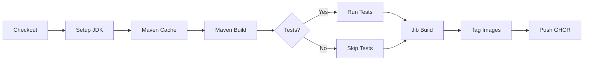
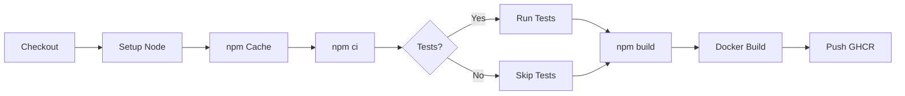
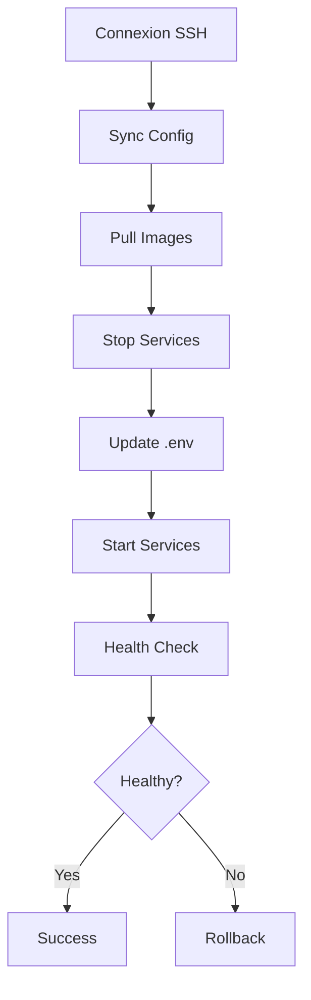

# 🏗️ Architecture CI/CD - DealToBook

Documentation technique détaillée de l'architecture CI/CD.

## 📋 Vue d'Ensemble

L'architecture CI/CD de DealToBook est basée sur **GitHub Actions** et suit les principes DevOps modernes:

- **Infrastructure as Code** (IaC)
- **Continuous Integration** (CI)
- **Continuous Deployment** (CD)
- **GitOps**
- **Immutable Infrastructure**

## 🎯 Objectifs

1. **Automatisation complète** du cycle de vie (build, test, deploy)
2. **Isolation des services** - chaque service buildé indépendamment
3. **Traçabilité** - chaque déploiement lié à un commit
4. **Rollback rapide** - retour arrière en moins de 2 minutes
5. **Scalabilité** - ajout de nouveaux services facilité
6. **Sécurité** - secrets chiffrés, environnements séparés

## 🏛️ Architecture Globale

```
┌─────────────────────────────────────────────────────────────────────┐
│                          GITHUB REPOSITORY                          │
│                                                                     │
│  ┌──────────────┐  ┌──────────────┐  ┌──────────────┐            │
│  │   Backend    │  │   Backend    │  │   Frontend   │            │
│  │  Services    │  │  Services    │  │   Services   │            │
│  │              │  │              │  │              │            │
│  │ - Generator  │  │ - Security   │  │ - WebUI      │            │
│  │ - Setting    │  │ - Website    │  │              │            │
│  └──────┬───────┘  └──────┬───────┘  └──────┬───────┘            │
│         │                 │                  │                     │
│         └─────────────────┴──────────────────┘                     │
│                           │                                        │
│                  ┌────────▼────────┐                              │
│                  │  .github/       │                              │
│                  │   workflows/    │                              │
│                  │                 │                              │
│                  │  - Individuels  │                              │
│                  │  - Orchestrator │                              │
│                  │  - Shared       │                              │
│                  └────────┬────────┘                              │
└───────────────────────────┼─────────────────────────────────────────┘
                            │
                   ┌────────▼────────┐
                   │  GitHub Actions │
                   │    Runners      │
                   │                 │
                   │  - ubuntu-latest│
                   │  - 2 CPU / 7GB  │
                   └────────┬────────┘
                            │
          ┌─────────────────┼─────────────────┐
          │                 │                 │
    ┌─────▼─────┐    ┌─────▼─────┐    ┌─────▼─────┐
    │   Build   │    │   Test    │    │  Docker   │
    │           │    │           │    │   Build   │
    │ - Maven   │    │ - JUnit   │    │           │
    │ - npm     │    │ - Jest    │    │ - Jib     │
    │           │    │           │    │ - Buildx  │
    └─────┬─────┘    └─────┬─────┘    └─────┬─────┘
          │                │                 │
          └────────────────┴─────────────────┘
                            │
                   ┌────────▼────────┐
                   │  GitHub         │
                   │  Container      │
                   │  Registry (GHCR)│
                   │                 │
                   │  ghcr.io/       │
                   │   skaouech/     │
                   └────────┬────────┘
                            │
                   ┌────────▼────────┐
                   │   Deployment    │
                   │    (SSH)        │
                   │                 │
                   │  deploy-ssl-    │
                   │   production-v2 │
                   └────────┬────────┘
                            │
          ┌─────────────────┼─────────────────┐
          │                 │                 │
    ┌─────▼─────┐    ┌─────▼─────┐    ┌─────▼─────┐
    │ Development│    │ Staging   │    │Production │
    │  Server    │    │  Server   │    │  Server   │
    │            │    │ (Optional)│    │           │
    │Hostinger   │    │           │    │Hostinger  │
    └────────────┘    └───────────┘    └───────────┘
```

## 🔧 Composants Techniques

### 1. Workflows GitHub Actions

#### 1.1 Workflows Shared (Réutilisables)

**`_shared-build-backend.yml`**
- Template générique pour tous les backends Spring Boot
- Gère: Maven, JDK setup, tests, Jib, GHCR push
- Paramétrable: version Java, profil Maven, skip tests, etc.

**`_shared-build-frontend.yml`**
- Template générique pour tous les frontends Angular
- Gère: npm, Node setup, tests, Docker Buildx, GHCR push
- Paramétrable: version Node, commande build, Dockerfile, etc.

**Avantages:**
- ✅ DRY (Don't Repeat Yourself)
- ✅ Maintenance centralisée
- ✅ Cohérence entre services
- ✅ Évolution facilitée

#### 1.2 Workflows Individuels

Un workflow par service:
- `backend-deal-generator.yml`
- `backend-deal-security.yml`
- `backend-deal-setting.yml`
- `backend-deal-website.yml`
- `frontend-deal-webui.yml`

**Caractéristiques:**
- Déclenché sur changement de fichiers spécifiques
- Appelle le workflow shared correspondant
- Personnalisation des paramètres par service

**Exemple:**
```yaml
jobs:
  build-and-push:
    uses: ./.github/workflows/_shared-build-backend.yml
    with:
      service-name: deal-generator
      service-directory: dealtobook-deal_generator
      ghcr-image-name: ghcr.io/skaouech/dealdealgenerator
      java-version: '17'
      maven-profile: prod
      skip-tests: false
      enable-sonar: true
      image-tag: latest
    secrets:
      GHCR_TOKEN: ${{ secrets.GITHUB_TOKEN }}
      SONAR_TOKEN: ${{ secrets.SONAR_TOKEN }}
```

#### 1.3 Workflow Orchestrateur

**`build-and-deploy-all.yml`**

**Fonctionnalités:**
1. **Détection intelligente** des services modifiés
2. **Build parallèle** de tous les services modifiés
3. **Déploiement orchestré** après build réussi
4. **Reporting** détaillé dans GitHub Summary

**Stratégies de détection:**

| Mode | Description |
|------|-------------|
| `all` | Build tous les services |
| `backends` | Build uniquement les backends |
| `frontends` | Build uniquement les frontends |
| `auto` | Détection basée sur `git diff` |

**Algorithme de détection:**
```bash
if files_changed in "dealtobook-deal_generator/**":
  build-generator = true
if files_changed in "dealtobook-deal_security/**":
  build-security = true
# etc.
```

#### 1.4 Workflows Utilitaires

**`deploy-only.yml`**
- Déploiement sans rebuild
- Utilisation d'images existantes dans GHCR
- Utile pour: redéploiement rapide, tests, changement de config

**`rollback.yml`**
- Rollback vers une version précédente
- Spécification du tag à restaurer
- Confirmation obligatoire (environnement GitHub)

### 2. Build Process

#### 2.1 Backend (Spring Boot + Jib)

**Technologies:**
- Maven 3.8+
- JDK 11 ou 17
- Jib Maven Plugin 3.4+

**Étapes:**



**Commandes Maven:**
```bash
# Build avec tests
./mvnw clean verify -Pprod

# Build sans tests
./mvnw clean package -Pprod -DskipTests

# Build Docker avec Jib
./mvnw -Pprod jib:dockerBuild -DskipTests
```

**Configuration Jib (pom.xml):**
```xml
<plugin>
    <groupId>com.google.cloud.tools</groupId>
    <artifactId>jib-maven-plugin</artifactId>
    <version>3.4.6</version>
    <configuration>
        <from>
            <image>eclipse-temurin:17-jre-focal</image>
        </from>
        <to>
            <image>dealdealgenerator:latest</image>
        </to>
        <container>
            <ports>
                <port>8083</port>
            </ports>
        </container>
    </configuration>
</plugin>
```

**Avantages Jib:**
- ✅ Pas besoin de Dockerfile
- ✅ Build multi-layers optimisé
- ✅ Cache intelligent
- ✅ Build sans Docker daemon
- ✅ Reproductible

#### 2.2 Frontend (Angular + Docker Buildx)

**Technologies:**
- Node.js 18+
- npm/yarn
- Docker Buildx

**Étapes:**



**Commandes:**
```bash
# Install
npm ci

# Tests
npm run test -- --watch=false --code-coverage --browsers=ChromeHeadless

# Build
npm run build

# Docker build (multi-platform)
docker buildx build \
  --platform linux/amd64,linux/arm64 \
  --push \
  -t ghcr.io/skaouech/deal-webui:latest \
  .
```

**Dockerfile Multi-Stage:**
```dockerfile
# Stage 1: Build
FROM node:18-alpine AS build
WORKDIR /app
COPY package*.json ./
RUN npm ci
COPY . .
RUN npm run build

# Stage 2: Runtime
FROM nginx:alpine
RUN apk add --no-cache gettext
COPY --from=build /app/dist /usr/share/nginx/html
COPY ./nginx-custom.conf /etc/nginx/conf.d/default.conf
COPY ./docker-entrypoint.sh /docker-entrypoint.sh
RUN chmod +x /docker-entrypoint.sh
EXPOSE 4200
ENTRYPOINT ["/docker-entrypoint.sh"]
```

**Avantages Multi-Stage:**
- ✅ Image finale petite (< 50MB)
- ✅ Pas de dépendances de build dans l'image finale
- ✅ Cache Docker optimisé
- ✅ Sécurité accrue

### 3. Registry (GHCR)

**GitHub Container Registry (ghcr.io)**

**Avantages:**
- ✅ Intégré à GitHub
- ✅ Gratuit pour repos publics
- ✅ Authentification via GITHUB_TOKEN
- ✅ Fine-grained access control
- ✅ Gestion des versions/tags

**Structure:**
```
ghcr.io/skaouech/
├── dealdealgenerator:latest
├── dealdealgenerator:develop
├── dealdealgenerator:sha-abc123
├── dealdealgenerator:v1.2.0
├── dealsecurity:latest
├── dealsecurity:develop
└── ...
```

**Tags Automatiques:**

| Tag | Quand | Description |
|-----|-------|-------------|
| `latest` | Push sur `main` | Version de production |
| `develop` | Push sur `develop` | Version de développement |
| `sha-{commit}` | Chaque build | Traçabilité commit |
| `{branch}` | Chaque branche | Feature branches |
| `v{version}` | Tag git | Releases officielles |

**Authentication:**
```bash
# GitHub Actions (automatique)
docker login ghcr.io -u ${{ github.actor }} -p ${{ secrets.GITHUB_TOKEN }}

# Local (manuel)
echo $GITHUB_TOKEN | docker login ghcr.io -u USERNAME --password-stdin
```

### 4. Deployment

**Script: `deploy-ssl-production-v2.sh`**

**Phases:**



**Commandes:**
```bash
# Déployer tous les services
./deploy-ssl-production-v2.sh deploy all

# Déployer services spécifiques
./deploy-ssl-production-v2.sh deploy generator security

# Avec tag spécifique
IMAGE_TAG=v1.2.0 ./deploy-ssl-production-v2.sh deploy all
```

**Docker Compose:**
```yaml
services:
  dealtobook-generator-backend:
    image: ghcr.io/skaouech/dealdealgenerator:${IMAGE_TAG:-latest}
    environment:
      - SPRING_PROFILES_ACTIVE=prod
      # ...
    healthcheck:
      test: ["CMD", "curl", "-f", "http://localhost:8083/management/health"]
      interval: 30s
      timeout: 10s
      retries: 3
```

## 🔄 Flux de Données

### Flux CI (Build)

```
Developer Push
     │
     ▼
GitHub Webhook
     │
     ▼
Trigger Workflow
     │
     ▼
Clone Repo (Actions Runner)
     │
     ▼
Setup Environment (Java/Node)
     │
     ▼
Restore Cache (Maven/npm)
     │
     ▼
Build + Tests
     │
     ▼
Build Docker Image (Jib/Buildx)
     │
     ▼
Tag Image (latest/develop/sha)
     │
     ▼
Push to GHCR
     │
     ▼
Report Status
```

### Flux CD (Deploy)

```
Build Success
     │
     ▼
SSH to Server
     │
     ▼
Sync Configuration Files
     │
     ▼
Docker Login to GHCR
     │
     ▼
Pull New Images (with correct tag)
     │
     ▼
Stop Old Containers
     │
     ▼
Start New Containers
     │
     ▼
Wait for Health Checks
     │
     ▼
Verify Services
     │
     ▼
Report Success/Failure
```

## 🔒 Sécurité

### 1. Secrets Management

**GitHub Secrets (Encrypted):**
- `SSH_PRIVATE_KEY` - Clé SSH privée (chiffrée)
- `HOSTINGER_USER` - Utilisateur SSH
- `HOSTINGER_IP` - IP du serveur
- `SONAR_TOKEN` - Token SonarQube (optionnel)

**Environnements GitHub:**
- `development` - Pas de protection
- `production` - Require approval, restricted branches

### 2. Permissions

**GitHub Actions:**
- Read access au repository
- Write access à GHCR
- Pas d'access aux autres repos

**SSH Key:**
- Clé dédiée pour CI/CD (pas de réutilisation)
- Pas de sudo sur le serveur (si possible)
- Rotation tous les 6 mois

### 3. Image Security

**Scanning (à configurer):**
```yaml
- name: Scan Docker Image
  uses: aquasecurity/trivy-action@master
  with:
    image-ref: ghcr.io/skaouech/dealdealgenerator:latest
    format: 'sarif'
    output: 'trivy-results.sarif'
```

## 📊 Performance

### Build Times

| Service | Build Time | Docker Build | Total |
|---------|-----------|--------------|-------|
| Generator | ~3 min | ~2 min | ~5 min |
| Security | ~3 min | ~2 min | ~5 min |
| Setting | ~3 min | ~2 min | ~5 min |
| Website | ~4 min | ~3 min | ~7 min |
| WebUI | ~2 min | ~2 min | ~4 min |

**Total (parallel):** ~7 min (service le plus lent)

### Optimisations

1. **Cache Maven/npm:**
   - Réduction de 50% du temps de build
   - Cache invalide uniquement si pom.xml/package.json change

2. **Docker Layer Caching:**
   - Jib: layers automatiques par Maven dependency
   - Buildx: cache GitHub Actions

3. **Parallel Builds:**
   - Tous les services buildent en parallèle
   - Limitation: resources du runner (2 CPU, 7GB RAM)

## 🔮 Évolutions Futures

### Short Term (1-3 mois)

- [ ] Ajouter tests E2E automatisés
- [ ] Intégrer SonarQube systématiquement
- [ ] Ajouter notifications Slack/Discord
- [ ] Configurer image scanning (Trivy)

### Medium Term (3-6 mois)

- [ ] Environnement de staging automatique
- [ ] Preview environments pour les PR
- [ ] Automated changelog generation
- [ ] Performance testing automatisé

### Long Term (6-12 mois)

- [ ] Migration vers Kubernetes (si nécessaire)
- [ ] Multi-region deployment
- [ ] Canary deployments
- [ ] Feature flags integration

## 📚 Références

- [GitHub Actions Documentation](https://docs.github.com/en/actions)
- [Jib Maven Plugin](https://github.com/GoogleContainerTools/jib/tree/master/jib-maven-plugin)
- [Docker Buildx](https://docs.docker.com/buildx/working-with-buildx/)
- [GHCR Documentation](https://docs.github.com/en/packages/working-with-a-github-packages-registry/working-with-the-container-registry)
- [GitOps Principles](https://www.gitops.tech/)

